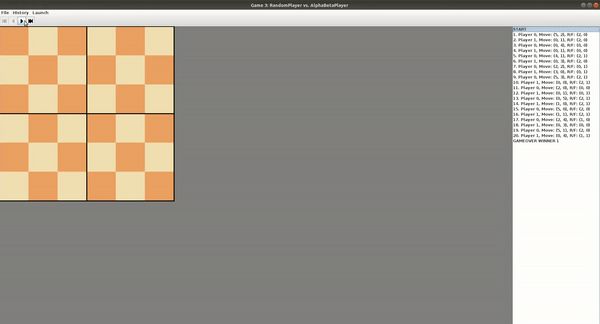

# pentago_twist

This repo is a copy of [SaminYeasar's repo](https://github.com/SaminYeasar/pentago_twist) with addition of my own implementation of student_player.

For details of my implementation, please see the [report](https://github.com/ikaier/MCTSAI/blob/master/submission/report.pdf).

Pentago-Twist falls into the Moku family of games. Other popular games in this category include Tic-Tac-Toe and Connect-4, although Pentago-Twist has significantly more complexity. The biggest difference in
Pentago-Twist is that the board is divided into quadrants, which can be flipped or rotate 90 degree right during the game.

## Setup 
Pentago-twist is a two-player game played on a 6x6 board, which consists of four 3x3 quadrants. To begin, the board is empty. The first player plays as white and the other plays as black.

## Objective 
In order to win, each player tries to achieve 5 pieces in a row before their opponent does. A winning row can be achieved horizontally, vertically or diagonally. If all spaces on the board are occupied without a winner then a draw is declared. If rotating/flipping single quadrant results in a five-in-a-row for both players, the game also ends in a draw.

## Playing
Moves consist of two phases: placing and rotating/flipping. On a given player's turn, a piece is first placed in an empty slot on the board. The player then selects a quadrant, and can choose either to flip or rotate 90 degree right. A
complete move therefore consists of placing a piece, then rotating/flipping.

## Strategy
Allowing quadrants to be flipped/rotated introduces significant complexity and your AI agent will need to contend with this high branching complexity. Since quadrants can be flipped/rotated, blocking an opponent's row is not as easy as simply placing an adjacent piece. A good AI agent might consider balancing seeking to win with preventing their opponent from achieving the same.

---

# Navigate through the scripts

    src  
    |  --- autoplay ( Autoplays games; can be ignored) 
    | --- boardgame (Package for implementing boardgames, logging, GUI, and server TCP protocol, can be ignored for this project)
    | --- student_player (Package containing your agent)
    |      | --- StudentPlayer.java (The class you will implement your AI within)
    |      | --- MyTools.java (Placeholder for any extra code you may need)} \nonumber 
    | --- pentago_swap (The package implementing all game logic)
    |      | --- PentagoBoardPanel.java (Implements the GUI, can be ignored)
    |      | --- PentagoBoard.java (Used for server logic, can be ignored)
    |      | --- PentagoCoord.java (Simple class representing a board coordinate)
    |      | --- PentagoMove.java (A move object for Pentago. Relevant functions)
    |      | --- PentagoBoardState.java (Implements all game logic, most important. Note that PentagoBoardState (PBS) manages} logic concerning whose turn it is, rules, and the positions of all pieces)
    |      | --- PentagoPlayer.java (Abstract class that all players extend)} 
    |      | --- RandomPentagoPlayer.java (A random player, can be used as a baseline)

